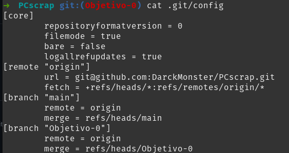

# PCscrap

## Problema inicial

Una persona que se dedica a montar ordenadores pasa demasiado tiempo mirando en distintas webs para encontrar la mejor para comprar un componente. Por tanto quiere comparar de forma rápida cada pieza para quedarse con la de mejor precio. Además quiere saber cuando hay ofertas, viendo que hay un mínimo en el precio del producto.

## Configuración del proyecto

### Clave ssh

### Configuración de repositorio

